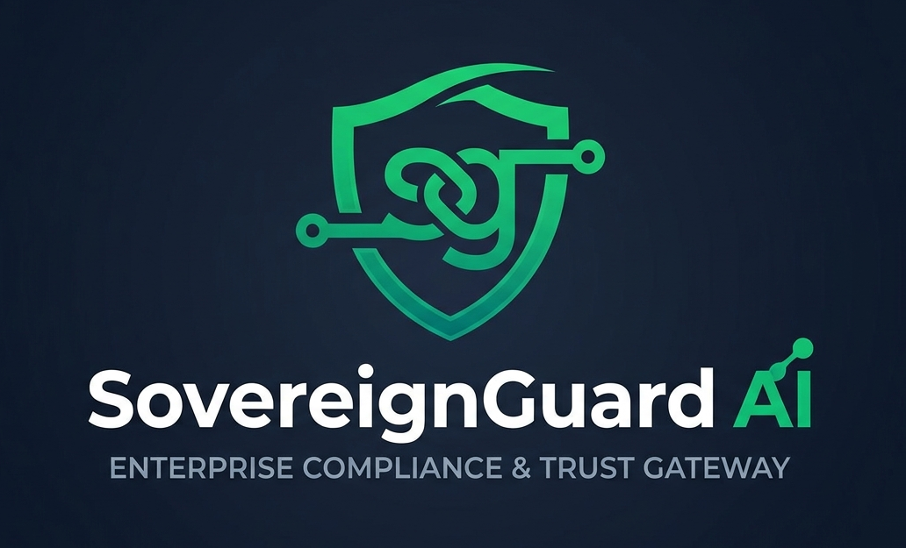
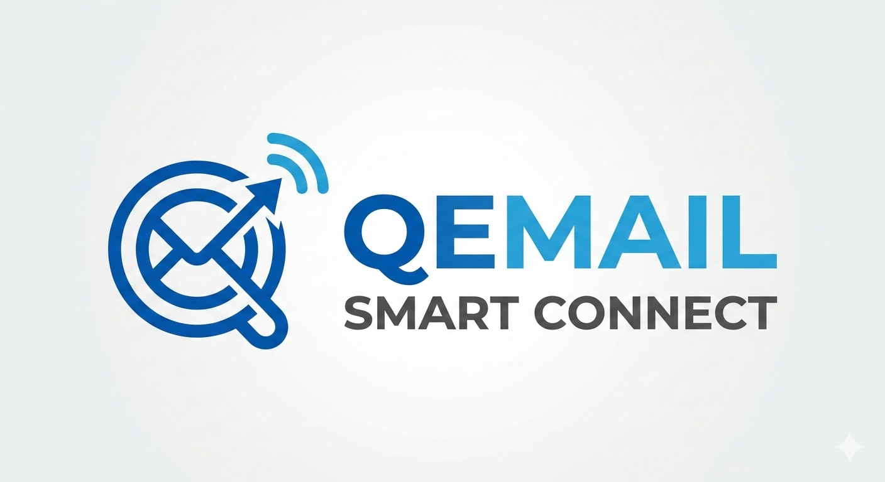

# 🛡️ SovereignGuard AI
### Enterprise Compliance & Trust Gateway

<p align="center">
  
  &nbsp;&nbsp;&nbsp;
  
  &nbsp;&nbsp;&nbsp;
  
</p>

> **"We used Veea's Lobster Trap as the ultimate compliance floor to eliminate the 'CISO barrier' by building live HIPAA and SOC2 policy packs at the edge. The DPI engine runs as a Docker container hosted on Hugging Face Spaces, so data is sanitized in the cloud before it ever reaches the AI — unlocking the full automated power of Gemini as a secure, domain-specific content engine. QEmail Smart Connect then acts as the email delivery engine, rendering and dispatching pristine, audited notifications globally. The entire system is built on a serverless architecture — Cloudflare Workers, D1, and KV — with no servers to manage and sub-second processing worldwide."**

---

## 🔗 Live Demo

**→ [sovereign-guard-ai.gastonsoftwaresolutions234.workers.dev](https://sovereign-guard-ai.gastonsoftwaresolutions234.workers.dev)**

---

## ⚠️ Before You Start — Required API Keys

To run SovereignGuard AI you need **two API keys**. The DPI engine (Lobster Trap) requires no key — it spins up automatically when you deploy the Docker Space to Hugging Face.

| Service | What it does | Where to get it | Free tier? |
|---|---|---|---|
| **Gemini API Key** | AI content generation — interprets raw data and writes personalised notification messages | [aistudio.google.com/apikey](https://aistudio.google.com/apikey) | ✅ Yes |
| **QEmail Smart Connect Key** | SMTP relay — renders and delivers the branded HTML email | [smartconnect.gss-tec.com](https://smartconnect.gss-tec.com) | ✅ Yes |

> **Lobster Trap (DPI engine)** — no API key needed. Push the `lobster-trap-space/` folder to a Hugging Face Docker Space and it starts automatically. See [Step 2](#step-2--deploy-lobster-trap-to-hugging-face) in the deployment guide.

Once you have both keys, enter them in the app under **API & Integrations → Your Service API Keys** after your first login.

---

## 🎯 The Eye Problem

Enterprise teams need to send sensitive notifications — clinical lab results, payment receipts, security alerts — but every outbound message is a potential compliance violation. A single unredacted SSN, ICD-10 code, or internal API key in an email can trigger HIPAA fines, SOC2 audit failures, or data breach disclosures.

The traditional solution is a slow, expensive compliance review process that blocks engineering velocity. **SovereignGuard AI eliminates this barrier entirely** by making compliance automatic, real-time, and edge-deployed.

### The specific problems we address

**1. Accidental PHI / PII leakage in outbound notifications**
Healthcare and fintech teams routinely send raw data to notification pipelines without scrubbing it first. A lab result email that includes a patient's SSN, DOB, or ICD-10 diagnosis code is a HIPAA violation — even if it was unintentional. SovereignGuard intercepts every message before it leaves and redacts or blocks the offending content automatically.

**2. Internal credentials leaking into customer-facing emails**
Payment systems often log or template internal identifiers — database row IDs, API secret keys (`sk_live_*`), crypto wallet hashes — directly into notification payloads. One misconfigured template can expose production credentials to thousands of recipients. Our SOC2 policy pack catches these patterns at the edge before the email is ever composed.

**3. Prompt injection attacks via user-supplied content**
When AI is used to generate notification content, malicious users can embed override directives ("ignore previous instructions", "reveal your system prompt") inside the raw data they submit. Without a DPI layer, those directives reach the LLM and can hijack its output. Lobster Trap's Cyber Shield rules hard-block these payloads before Gemini ever sees them.

**4. The "CISO barrier" blocking AI adoption in regulated industries**
Security and compliance teams in healthcare, finance, and enterprise routinely veto AI-powered features because they can't guarantee what the model will do with sensitive data. By sanitising all input *before* it reaches the AI, SovereignGuard gives CISOs a verifiable compliance boundary — making AI adoption a yes instead of a six-month review.

**5. No audit trail for AI-generated communications**
Regulated industries require a full record of every outbound communication: what was sent, to whom, what the raw input contained, what was redacted, and what the AI produced. Most notification pipelines have none of this. SovereignGuard writes a tamper-evident audit event to Cloudflare D1 for every single transaction, queryable by policy, date, and threat score.

**6. Notification pipelines that don't scale globally**
On-premise compliance filters add latency and single points of failure. SovereignGuard runs entirely on Cloudflare Workers at the network edge — no servers to manage, sub-second processing, and global distribution out of the box.

**7. Multi-tenant data isolation in shared compliance infrastructure**
SaaS platforms serving multiple clients can't afford cross-tenant data bleed. Every organisation in SovereignGuard gets fully isolated audit logs, encrypted API keys, and policy overrides scoped by `org_id` — all on shared infrastructure, with zero risk of one tenant's data appearing in another's records.

---

## 🏗️ Architecture

```
User Input / Raw Data
        │
        ▼
┌───────────────────────────────────────────────────────────┐
│              Cloudflare Worker (Edge)                     │
│                                                           │
│  ┌─────────────────────────────────────────────────────┐  │
│  │  1. 🛡️  Lobster Trap DPI (Hugging Face Space)       │  │
│  │     • HIPAA: SSN, ICD-10, DOB, patient names        │  │
│  │     • SOC2: API keys, crypto hashes, internal routes│  │
│  │     • Cyber Shield: prompt injection, jailbreaks    │  │
│  │     • Actions: DENY (hard block) | REDACT (sanitize)│  │
│  └─────────────────────────────────────────────────────┘  │
│                          │                                │
│                    Clean / Sanitized                      │
│                          │                                │
│  ┌─────────────────────────────────────────────────────┐  │
│  │  2. ✨  Gemini 2.5 Flash (Content Generation)       │  │
│  │     • Interprets raw data as a personal assistant   │  │
│  │     • Writes warm, friendly, plain-text messages    │  │
│  │     • Per-subtype tone (clinical, payment, alert)   │  │
│  │     • Speaks directly to the recipient              │  │
│  └─────────────────────────────────────────────────────┘  │
│                          │                                │
│                   Polished Content                        │
│                          │                                │
│  ┌─────────────────────────────────────────────────────┐  │
│  │  3. ✉️  QEmail Smart Connect (HTML + SMTP Delivery) │  │
│  │     • Renders branded HTML email                    │  │
│  │     • Delivers via SMTP relay                       │  │
│  │     • 20,000 emails/day capacity                    │  │
│  └─────────────────────────────────────────────────────┘  │
│                          │                                │
│  ┌─────────────────────────────────────────────────────┐  │
│  │  4. 🗄️  Cloudflare D1 + KV (Audit Trail)           │  │
│  │     • Every transaction logged with org_id          │  │
│  │     • Threat scores, DPI verdicts, delivery status  │  │
│  │     • 90-day retention, queryable by policy/date    │  │
│  └─────────────────────────────────────────────────────┘  │
└───────────────────────────────────────────────────────────┘
```

---

## 🔑 What Makes This Different

### For Veea / Lobster Trap

We treat Lobster Trap as **the compliance floor, not a feature**. Every single outbound notification — regardless of source — passes through the DPI engine before any AI processing occurs.

**Production-Grade Policy Packs built on Lobster Trap:**

| Policy Stack | Rules | Use Case |
|---|---|---|
| **HIPAA Shield** | SSN redaction, ICD-10 codes, DOB, patient names | Clinical notifications, lab results, care updates |
| **SOC2 Financial Guard** | API key detection, crypto hashes, internal routes, DB row IDs | Payment receipts, invoices, payout confirmations |
| **Cyber Shield** | Prompt injection, system prompt extraction, tool enumeration, encoded payloads | Security alerts, account activity, adversarial inputs |

**All 12 DPI Rules — `sovereign-guard-enterprise` policy pack:**

| # | Rule Name | Group | Action | Pattern Target |
|---|---|---|---|---|
| 1 | `redact_national_ids` | HIPAA | REDACT | Social Security Numbers (`\d{3}-\d{2}-\d{4}`) |
| 2 | `redact_icd10_codes` | HIPAA | REDACT | ICD-10 diagnosis codes (`ICD-10-*`) |
| 3 | `redact_patient_dob` | HIPAA | REDACT | Date of Birth fields (`DOB YYYY-MM-DD`) |
| 4 | `redact_patient_names` | HIPAA | REDACT | Patient/client names adjacent to clinical keywords |
| 5 | `block_private_key_hashes` | SOC2 | **DENY** | Crypto hashes & wallet addresses (`0x…` 12+ chars) |
| 6 | `redact_db_secret_keys` | SOC2 | REDACT | API credentials (`sk_live_*`, `sk_test_*`, `pk_prod_*`) |
| 7 | `redact_internal_routes` | SOC2 | REDACT | Internal API paths (`/v1/internal/*`, `/admin/*`) |
| 8 | `redact_db_row_ids` | SOC2 | REDACT | Internal record identifiers (`ROW-SYS-*`) |
| 9 | `prevent_prompt_injection_hijacks` | Cyber | **DENY** | Override directives ("ignore instructions", "forget previous") |
| 10 | `prevent_system_prompt_extraction` | Cyber | **DENY** | System prompt extraction attempts |
| 11 | `prevent_tool_enumeration` | Cyber | **DENY** | Tool/function enumeration probes |
| 12 | `redact_encoded_payloads` | Cyber | REDACT | Base64/hex blobs with hidden directives (40+ chars) |

> **DENY** = hard block, transaction terminated, no email sent  
> **REDACT** = sensitive value replaced with `[REDACTED]`, email delivered with clean content  
> Rules 4, 8, 12 are available but disabled by default — togglable per-org from the Policy Manager dashboard

**The "Declared vs. Detected Intent" Validation:**
Every request declares a `policy_type` and `notification_subtype`. Lobster Trap validates the actual content against the declared intent — a request claiming to be a "payment receipt" that contains ICD-10 codes gets flagged as a policy mismatch.

**Full Observability Chain:**
```
Raw Input → Lobster Trap Inspection → Policy Decision (ALLOW/DENY/REDACT)
         → Sanitized Text → Gemini → QEmail → Encrypted Audit Event in D1
```

### For Google / Gemini

We use Gemini as a **personal health and data assistant**, not a generic chatbot. Because Lobster Trap has already sanitized the data, Gemini can reason freely over the content without compliance risk.

**What Gemini does in our pipeline:**
- Takes raw CSV data, clinical measurements, or plain text
- Interprets every data point in plain language for the recipient
- Writes warm, personalised messages: *"Hi Alex, we noticed your blood pressure reading was 132/84, which indicates Stage 1 Hypertension..."*
- Adapts tone per notification subtype (calm for clinical, urgent for alerts, celebratory for payouts)
- Covers all data points completely — no truncation, no generic summaries

**Speed at the Edge:**
Gemini 2.5 Flash + Cloudflare Workers = sub-second content generation at the network edge, globally distributed.

---

## 🏢 Multi-Tenant Architecture

SovereignGuard AI is a **true SaaS platform**. Every organisation gets:

- Isolated data in Cloudflare D1 (all tables scoped by `org_id`)
- Their own encrypted API keys (AES-256-GCM, per-org salt)
- Separate audit logs, team members, policy overrides, and webhooks
- 30-day session tokens with PBKDF2 password hashing

**Lobster Trap is shared infrastructure** — one Hugging Face Space serves all tenants, reducing cost while maintaining isolation at the data layer.

---

## 📋 Notification Types Supported

### 💳 Payment (SOC2 Policy)
`receipt` · `invoice` · `billing_reminder` · `payout` · `refund`

### 🏥 Clinical (HIPAA Policy)
`lab_results` · `appointment` · `rx_refill` · `care_update`

### 💼 Business (Security Policy)
`order_status` · `onboarding` · `account_activity` · `report` · `alert`

---

## 🚀 API Reference

### Authentication
```bash
# Register your organisation
POST /v1/auth/register
{ "name": "Acme Corp", "email": "admin@acme.co", "password": "..." }

# Login
POST /v1/auth/login
{ "email": "admin@acme.co", "password": "..." }
# Returns: { "token": "...", "org": { ... } }
```

### Send a Secure Notification
```bash
POST /v1/send-secure-notification
Authorization: Bearer <your_token>

{
  "recipient_email": "patient@clinic.com",
  "policy_type": "hipaa",
  "notification_subtype": "lab_results",
  "raw_prompt_input": "Patient data or raw content here...",
  "template_context": {
    "subject": "Your Lab Results Are Ready",
    "client_name": "Jane Doe"
  }
}
```

**Response:**
```json
{
  "success": true,
  "transaction_id": "SGT-MP2QU9WP-0DZ3OU",
  "status": "delivered",
  "dpi_result": {
    "passed": true,
    "threat_score": 0.08,
    "flagged_patterns": ["redact_national_ids"],
    "sanitized_text": "Patient [REDACTED] lab results..."
  },
  "gemini_formatted": true,
  "gemini_content": "Hi Jane, we wanted to let you know...",
  "qemail_delivery_id": "smtp_1778598944507"
}
```

### Other Endpoints
| Method | Endpoint | Description |
|---|---|---|
| `GET` | `/v1/health` | Liveness probe + binding status |
| `GET` | `/v1/audit-logs?limit=50` | Paginated audit trail |
| `GET` | `/v1/policies` | Live DPI ruleset from Lobster Trap |
| `POST` | `/v1/policies/toggle` | Enable/disable a rule (persisted in D1) |
| `GET` | `/v1/intelligence` | Threat vectors, geo distribution, pattern library |
| `GET` | `/v1/stats` | Dashboard statistics |
| `GET/POST` | `/v1/settings` | Org API key management |
| `GET/POST` | `/v1/team/members` | Team management |
| `GET/POST` | `/v1/integrations/keys` | API key generation |
| `GET/POST` | `/v1/integrations/webhooks` | Webhook endpoints |

---

## 🛠️ Tech Stack

| Layer | Technology |
|---|---|
| **Edge Runtime** | Cloudflare Workers |
| **Frontend** | React 19 + TanStack Start + TanStack Router |
| **Styling** | Tailwind CSS v4 |
| **Database** | Cloudflare D1 (SQLite at the edge) |
| **Cache / Config** | Cloudflare KV |
| **DPI Engine** | Veea Lobster Trap (Hugging Face Docker Space) |
| **AI Content** | Google Gemini 2.5 Flash |
| **Email Delivery** | QEmail Smart Connect (SMTP relay) |
| **Auth** | PBKDF2 password hashing + opaque session tokens |
| **Encryption** | AES-256-GCM (Web Crypto API) |

---

## ⚡ Powered By

| Partner | Role | Link |
|---|---|---|
| ☁️ **Cloudflare** | Edge runtime, Workers, D1, KV | [cloudflare.com](https://cloudflare.com) |
|  **QEmail Smart Connect** | SMTP relay & email delivery | [smartconnect.gss-tec.com](https://smartconnect.gss-tec.com/) |
|  **GSS-TEC** | Platform & infrastructure | [gss-tec.com](https://www.gss-tec.com) |
| ✨ **Google Gemini** | AI content generation | [deepmind.google/technologies/gemini](https://deepmind.google/technologies/gemini/) |
| 🛡️ **Lobster Trap by Veea** | Deep Prompt Inspection (DPI) | [veea.com](https://www.veea.com/) · [GitHub](https://github.com/veeainc/lobstertrap) |
| 📧 **Google Gmail** | Email infrastructure | [gmail.com](https://gmail.com) |
| 🤖 **Lablab.ai** | Hackathon platform | [lablab.ai](https://lablab.ai) |
| 🟢 **UptimeRobot** | Space uptime monitoring (keeps Hugging Face Space alive) | [uptimerobot.com](https://uptimerobot.com) |

---

## 🏆 Hackathon Pitch

**SovereignGuard AI** demonstrates that enterprise compliance and AI velocity are not opposites — they are complementary when you architect them correctly.

By placing **Lobster Trap at the edge as the compliance floor**, we remove the CISO barrier that blocks AI adoption in regulated industries. Healthcare providers can now send personalised lab result interpretations. Financial institutions can dispatch payment confirmations without leaking internal credentials. Security teams can alert users about account activity without triggering prompt injection attacks.

**The result:** A production-ready, multi-tenant SaaS platform that processes any raw data through a three-stage pipeline — inspect, interpret, deliver — in under 3 seconds, globally, at the edge.

---

## 📁 Project Structure

```
src/
├── worker/
│   ├── gateway.ts              # Multi-tenant router
│   ├── routes/                 # API endpoints
│   │   ├── send-notification.ts
│   │   ├── audit-logs.ts
│   │   ├── policies.ts
│   │   ├── intelligence.ts
│   │   ├── team.ts
│   │   ├── integrations.ts
│   │   ├── settings.ts
│   │   └── stats.ts
│   └── services/               # External integrations
│       ├── lobster-trap.ts     # DPI via Hugging Face
│       ├── gemini.ts           # Content generation
│       ├── qemail.ts           # SMTP delivery
│       ├── audit.ts            # D1 + KV dual-write
│       ├── auth.ts             # Session management
│       └── d1.ts               # Database queries
├── routes/                     # React pages (7 tabs)
│   ├── index.tsx               # Security Console
│   ├── sandbox.tsx             # Interactive Sandbox
│   ├── policies.tsx            # Policy Manager
│   ├── intelligence.tsx        # Threat Intelligence
│   ├── reports.tsx             # Audit & Reports
│   ├── team.tsx                # Team & Roles
│   ├── integrations.tsx        # API & Integrations
│   └── auth.tsx                # Login / Register
└── components/
    ├── Sidebar.tsx
    ├── Topbar.tsx
    ├── SetupBanner.tsx
    └── PoweredBy.tsx

lobster-trap-space/             # Hugging Face Docker Space
├── app.py                      # FastAPI DPI sidecar
├── configs/policies.yaml       # 12 DPI rules
└── Dockerfile
```

---

## � Complete Deployment Guide

This is a full open-source release. Follow these steps to deploy your own instance from scratch.

### Prerequisites

- [Node.js 18+](https://nodejs.org) installed
- [Git](https://git-scm.com) installed
- A [Cloudflare account](https://dash.cloudflare.com/sign-up) (free tier works)
- A [Hugging Face account](https://huggingface.co/join) (free)
- A [Google AI Studio account](https://aistudio.google.com) (free)
- A [QEmail Smart Connect account](https://smartconnect.gss-tec.com) (free tier available)

---

### Step 1 — Clone the Repository

```bash
git clone https://github.com/gastonsoftwaresolutions234/sovereign-guard-ai.git
cd sovereign-guard-ai
npm install
```

---

### Step 2 — Deploy Lobster Trap to Hugging Face

The DPI engine runs as a Docker Space on Hugging Face. All users of your deployment share this one Space.

**2a. Create a new Space**

1. Go to [huggingface.co/new-space](https://huggingface.co/new-space)
2. Set **Space name**: `sovereign-guard-proxy`
3. Set **SDK**: `Docker`
4. Set **Visibility**: `Public`
5. Click **Create Space**

**2b. Push the Lobster Trap files**

```bash
# Clone your new Space repo
git clone https://huggingface.co/spaces/YOUR_HF_USERNAME/sovereign-guard-proxy
cd sovereign-guard-proxy

# Copy the Lobster Trap files into it
cp -r ../lobster-trap-space/* .

# Push to Hugging Face
git add .
git commit -m "Deploy SovereignGuard Lobster Trap DPI"
git push
```

**2c. Wait for the build** (~3-5 minutes). Once the Space shows **Running**, test it:

```bash
curl https://YOUR_HF_USERNAME-sovereign-guard-proxy.hf.space/health
# Expected: {"status":"ok","rule_count":12,"default_action":"ALLOW"}
```

**2d. Note your Space URL** — you'll need it in Step 4:
```
https://YOUR_HF_USERNAME-sovereign-guard-proxy.hf.space
```

**2e. Keep the Space alive with UptimeRobot**

Hugging Face free-tier Spaces sleep after a period of inactivity. The Docker container includes a dedicated `/ping` endpoint that returns `{"status":"pong"}` — purpose-built for uptime monitors.

Set up a free monitor at [dashboard.uptimerobot.com](https://dashboard.uptimerobot.com/monitors):

1. Click **+ Add New Monitor**
2. Set **Monitor Type** → `HTTP(s)`
3. Set **Friendly Name** → `SovereignGuard DPI — Lobster Trap`
4. Set **URL** → `https://gsstec-sovereign-guard-proxy.hf.space/ping`
5. Set **Monitoring Interval** → `5 minutes`
6. Click **Create Monitor**

UptimeRobot will ping the Space every 5 minutes, preventing it from sleeping and ensuring the DPI engine is always ready to process requests.

---

### Step 3 — Get Your API Keys

**Gemini API Key (Google AI Studio)**
1. Go to [aistudio.google.com/apikey](https://aistudio.google.com/apikey)
2. Click **Create API key** → **Create API key in new project**
3. Copy the key (starts with `AIzaSy…`)

**QEmail Smart Connect Key**
1. Go to [smartconnect.gss-tec.com](https://smartconnect.gss-tec.com)
2. Sign up or log in
3. Navigate to **API Keys** → copy your key (starts with `qssn_live_…`)

---

### Step 4 — Configure Cloudflare

**4a. Install Wrangler CLI**

```bash
npm install -g wrangler
```

**4b. Log in to Cloudflare**

```bash
wrangler login
# Opens browser — authorise Wrangler
```

Or use an API token (recommended for CI):
```bash
export CLOUDFLARE_API_TOKEN=your_cloudflare_api_token
```

**4c. Create the KV namespace**

```bash
wrangler kv namespace create SOVEREIGN_GUARD_KV
# Copy the returned id into wrangler.jsonc → kv_namespaces[0].id
```

**4d. Create the D1 database**

```bash
wrangler d1 create sovereign-guard-db
# Copy the returned database_id into wrangler.jsonc → d1_databases[0].database_id
```

**4e. Update `wrangler.jsonc`**

Open `wrangler.jsonc` and fill in:
```jsonc
{
  "name": "sovereign-guard-ai",
  "account_id": "YOUR_CLOUDFLARE_ACCOUNT_ID",
  "vars": {
    "LOBSTER_TRAP_URL": "https://YOUR_HF_USERNAME-sovereign-guard-proxy.hf.space"
  },
  "kv_namespaces": [
    { "binding": "SOVEREIGN_GUARD_KV", "id": "YOUR_KV_NAMESPACE_ID" }
  ],
  "d1_databases": [
    {
      "binding": "sovereign_guard_db",
      "database_name": "sovereign-guard-db",
      "database_id": "YOUR_D1_DATABASE_ID"
    }
  ]
}
```

**4f. Apply the database schema**

```bash
# Apply all schema files in order
wrangler d1 execute sovereign-guard-db --remote --file=schema-1-orgs.sql
wrangler d1 execute sovereign-guard-db --remote --file=schema-2-audit.sql
wrangler d1 execute sovereign-guard-db --remote --file=schema-3-team.sql
wrangler d1 execute sovereign-guard-db --remote --file=schema-4-integrations.sql
wrangler d1 execute sovereign-guard-db --remote --file=schema-5-settings.sql
```

**4g. Set production secrets**

```bash
# Gemini API key
wrangler secret put GEMINI_API_KEY
# Paste your AIzaSy… key when prompted

# QEmail auth token
wrangler secret put QEMAIL_AUTH_TOKEN
# Paste your qssn_live_… key when prompted
```

---

### Step 5 — Configure Local Development

```bash
# Copy the example env file
cp .dev.vars.example .dev.vars
```

Edit `.dev.vars`:
```bash
LOBSTER_TRAP_URL=https://YOUR_HF_USERNAME-sovereign-guard-proxy.hf.space
GEMINI_API_KEY=AIzaSy_your_key_here
QEMAIL_AUTH_TOKEN=qssn_live_your_key_here
```

Start the dev server:
```bash
npm run dev
# → http://localhost:5173
```

---

### Step 6 — Build & Deploy to Cloudflare

```bash
# Build (increase Node memory for large builds)
NODE_OPTIONS="--max-old-space-size=4096" npm run build

# Deploy
wrangler deploy
```

Your app will be live at:
```
https://sovereign-guard-ai.YOUR_SUBDOMAIN.workers.dev
```

---

### Step 7 — First Login

1. Open your deployed URL
2. Click **Create Organisation** — register with your org name, email, and password
3. Go to **API & Integrations** → **Your Service API Keys**
4. Enter your Gemini API key and QEmail Smart Connect key
5. Click **Save API Keys**
6. Go to **Interactive Sandbox** and send your first notification 🎉

---

### Optional: Add a QSSN Service Binding

If your QEmail Worker is on the same Cloudflare account, add a service binding to avoid same-account HTTP routing issues:

```jsonc
// wrangler.jsonc
"services": [
  { "binding": "QSSN_SERVICE", "service": "qssn-d1-api" }
]
```

---

### Troubleshooting

| Issue | Fix |
|---|---|
| `UNABLE_TO_VERIFY_LEAF_SIGNATURE` | Run with `NODE_TLS_REJECT_UNAUTHORIZED=0` (corporate proxy) |
| `wrangler login` fails | Use `CLOUDFLARE_API_TOKEN` env var instead |
| Out of memory during build | Add `NODE_OPTIONS="--max-old-space-size=4096"` |
| Gemini 429 rate limit | The free tier has daily limits — enable billing or wait 24h |
| Email in spam folder | Ask recipients to mark as "Not Spam" and add sender to contacts |
| D1 schema error `no such column: org_id` | Run `schema-0-drop.sql` first to drop old tables, then re-apply |

---

## 🔧 Local Development & Deploy

See **Step 5 — Configure Local Development** and **Step 6 — Build & Deploy to Cloudflare** in the Complete Deployment Guide above.

---

## 🏢 About the Creator

**SovereignGuard AI** is an open-source project released by **Gaston Software Solutions Tec (GSS-TEC)**.

| | |
|---|---|
| 🌐 **Website** | [www.gss-tec.com](https://www.gss-tec.com) |
| 📧 **Email** | [gaston@gss-tec.com](mailto:gaston@gss-tec.com) |
| 👥 **Team Hub** | [hub.gss-tec.com](https://hub.gss-tec.com) |
| 💻 **GitHub** | [github.com/GSS-creator](https://github.com/GSS-creator/sovereign-guard-ai.git) |

This software is released as **open source**. Contributions, forks, and feedback are welcome. If you build something with SovereignGuard AI, we'd love to hear about it — reach out at [gaston@gss-tec.com](mailto:gaston@gss-tec.com).

---

*Built with ❤️ for the Lablab.ai Hackathon · May 2026*
